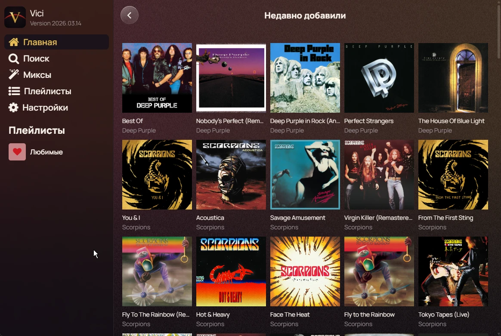
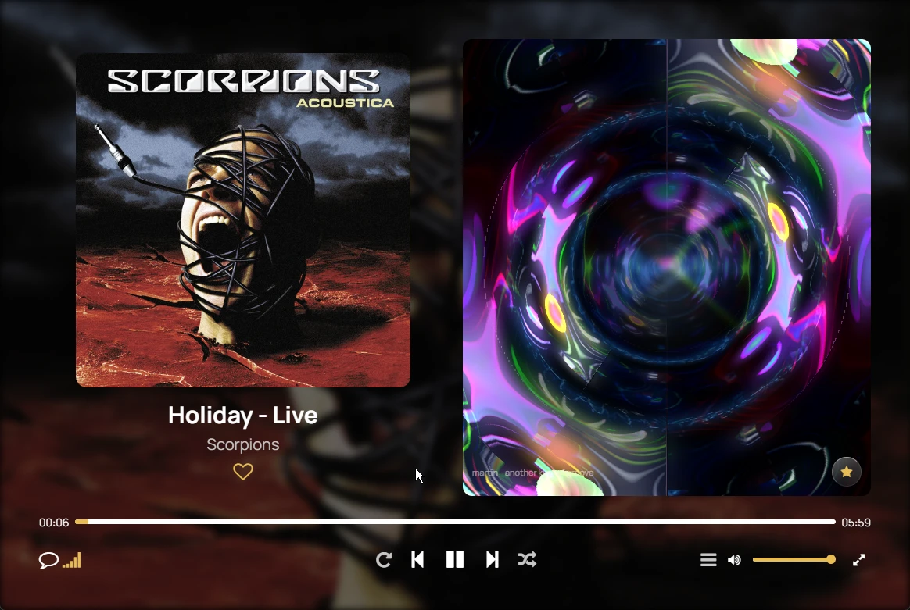
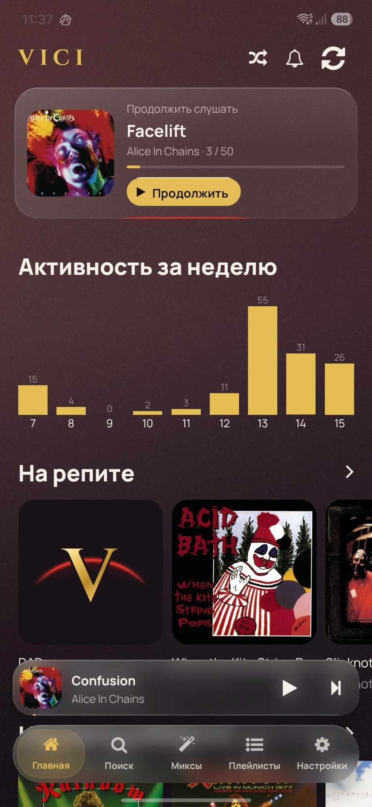
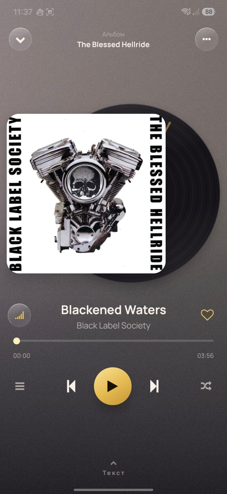

<p align="center">
  
</p>

<p align="center">
  <a href="https://github.com/Aut0iq/Vici/releases/latest"></a>
  <a href="https://github.com/Aut0iq/Vici/actions/workflows/android-release.yml"></a>
  <a href="LICENSE"></a>
  
  
</p>

<p align="center">
  <b>Vici</b> — музыкальный плеер для вашего собственного сервера <a href="https://www.navidrome.org/">Navidrome</a>
  и любого другого с Subsonic API. Для телефона и для компьютера.
</p>

---

## Скриншоты

<table>
  <tr>
    <td width="50%"></td>
    <td width="50%"></td>
  </tr>
  <tr>
    <td align="center"><sub>Фонотека: боковое меню, обложка играющего трека, очередь</sub></td>
    <td align="center"><sub>Полноэкранный плеер: обложка слева, визуализатор справа</sub></td>
  </tr>
</table>

<table>
  <tr>
    <td width="50%"></td>
    <td width="50%"></td>
  </tr>
  <tr>
    <td align="center"><sub>Главная: продолжить слушать и разделы фонотеки</sub></td>
    <td align="center"><sub>Плеер с обложкой и вращающейся пластинкой</sub></td>
  </tr>
</table>

## Возможности

### Внешний вид

- **Фон из обложки.** Интерфейс мягко окрашивается в цвета играющего трека и меняется вместе с ним.
- **Размытие вместо заливки.** Парящее нижнее меню, мини-плеер и карточки сделаны полупрозрачными, с настоящим размытием и светлой кромкой.
- **Полноэкранный плеер** с обложкой и вращающейся пластинкой. Свайп влево и вправо по обложке переключает трек, вверх открывает текст песни, вниз сворачивает плеер.
- **Визуализатор.** Полноэкранные эффекты MilkDrop на движке [butterchurn] — 187 пресетов, реагирующих на звук.

### Музыка

- **Тексты песен** с построчной подсветкой: берутся с вашего сервера или из [LRCLIB] с проверкой длительности трека, чтобы текст не перепутался.
- **Скробблинг Last.fm** отправляется прямо с устройства, серверу для этого ничего настраивать не нужно. Есть очередь для офлайна и счётчик отправленного.
- **Миксы.** Отдельная вкладка для плейлистов под настроение, чьё название заканчивается на «mix».
- **Продолжить слушать.** Карточка на главной с последней очередью.
- **Кэширование** соседних треков для мгновенного переключения и работы без сети.
- Радиостанции, избранное, плейлисты, поиск, трансляция по сети и всё остальное, что умеет Castafiore.

### Телефон

- **Настройка нижнего меню.** Любую вкладку можно убрать из панели, вернуть обратно или переставить. Отдельно выбирается, участвует ли вкладка в переключении свайпом.
- **Переключение свайпом** влево и вправо между вкладками.
- **Автозапуск при подключении наушников.** Подключили гарнитуру — музыка продолжает играть, даже если приложение было закрыто.
- **Виджет 5×1** для рабочего стола: обложка, название, управление, цвет под обложку. Нажатие открывает плеер на весь экран.

### Компьютер

- **Боковое меню** с плейлистами и крупной обложкой того, что играет сейчас.
- **Очередь воспроизведения** отдельной колонкой справа: видно, что было и что будет дальше.
- **Полноэкранный режим** с обложкой на одной половине экрана и визуализатором на другой; текст песни ложится поверх визуализатора.
- **Медиа-клавиши** на клавиатуре и карточка трека в панели громкости Windows.
- **Работа из трея.** Крестик прячет окно, музыка продолжает играть.
- **Автообновление** — приложение само предложит установить новую версию.

## Установка

### Android через Obtainium (с автообновлениями)

1. Установите [Obtainium](https://github.com/ImranR98/Obtainium/releases).
2. **Add App** → вставьте `https://github.com/Aut0iq/Vici` → **Add**.
3. Установите Vici из списка. О новых версиях Obtainium сообщит сам.

### Android вручную

Скачайте `vici-*.apk` со страницы [последнего релиза](https://github.com/Aut0iq/Vici/releases/latest) и откройте его на телефоне.

### Windows

Скачайте `Vici-Setup-*.exe` со страницы [последнего релиза](https://github.com/Aut0iq/Vici/releases/latest) и запустите. Установщик не требует прав администратора и ставит приложение только для текущего пользователя. Дальше Vici обновляется сам.

При первом запуске укажите адрес своего сервера (например, `https://music.example.com`), логин и пароль.

## Сборка из исходников

Нужны Node.js 22, JDK 17 и Android SDK.

```bash
npm ci

# Версия для разработки (ставится рядом с обычной, работает с сервером разработки)
npx cross-env IS_DEV=true expo run:android

# Обычная сборка APK
npx expo prebuild --clean --platform android
cd android && ./gradlew assembleRelease -PreactNativeArchitectures=arm64-v8a
```

### Версия для компьютера

Настольное приложение — это веб-сборка Vici, упакованная в Electron. Подробности в [desktop/README.md](desktop/README.md).

```bash
# Запустить в окне, без сборки установщика
npm run desktop

# Собрать установщик в desktop/release
npm run export:desktop
```

### Автоматические релизы

APK и установщик для Windows собираются GitHub Actions при отправке тега:

```bash
git tag v2026.09.21
git push origin v2026.09.21
```

Через 20–30 минут на странице Releases появится новая версия с обоими файлами.

## Благодарности

- [Castafiore](https://github.com/sawyerf/Castafiore) от **sawyerf** — проект, на основе которого создан Vici.
- [Navidrome](https://www.navidrome.org/) — музыкальный сервер.
- [LRCLIB] — открытая база синхронизированных текстов песен.
- [butterchurn] — реализация визуализатора MilkDrop для веба.
- Шрифты [Manrope](https://fonts.google.com/specimen/Manrope) и [Cinzel](https://fonts.google.com/specimen/Cinzel) (SIL Open Font License).
- [React Native Track Player](https://github.com/doublesymmetry/react-native-track-player), [Expo](https://expo.dev/), [Electron](https://www.electronjs.org/), [react-native-android-widget](https://github.com/sAleksovski/react-native-android-widget).

## Лицензия

Vici распространяется под лицензией [MIT](LICENSE) © 2026 [Aut0iq](https://github.com/Aut0iq).

Код можно свободно использовать, изменять и распространять, в том числе в своих проектах, при условии сохранения уведомления об авторских правах и текста лицензии.

Vici основан на [Castafiore](https://github.com/sawyerf/Castafiore), исходный код которого передан в общественное достояние ([Unlicense](https://unlicense.org/)).

[LRCLIB]: https://lrclib.net/
[butterchurn]: https://github.com/jberg/butterchurn
