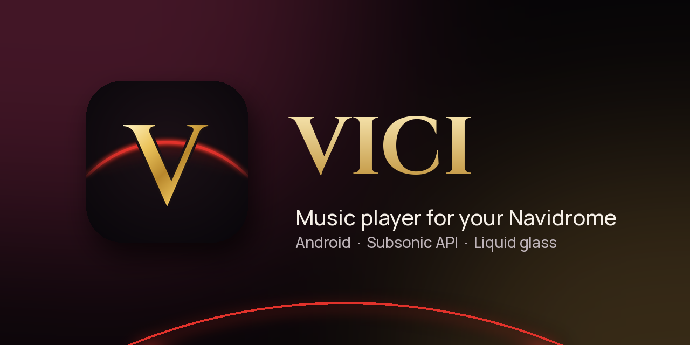

<p align="center">
  
</p>

<p align="center">
  <a href="https://github.com/Aut0iq/Vici/releases/latest"></a>
  <a href="https://github.com/Aut0iq/Vici/actions/workflows/android-release.yml"></a>
  
  
</p>

<p align="center">
  <b>Vici</b> — музыкальный плеер для вашего собственного сервера <a href="https://www.navidrome.org/">Navidrome</a>
  (и любого сервера с Subsonic API) в стиле «жидкого стекла».
</p>

---

## Возможности

- **Фон из обложки.** Интерфейс мягко окрашивается в цвета играющего трека.
- **Жидкое стекло.** Парящее нижнее меню и мини-плеер с настоящим размытием, стеклянные карточки и меню.
- **Полноэкранный плеер** с обложкой и вращающейся пластинкой. Свайп влево и вправо по обложке переключает трек, вверх — открывает текст песни, вниз — сворачивает плеер.
- **Тексты песен** с построчной подсветкой: берутся с вашего сервера или из [LRCLIB] с проверкой длительности трека, чтобы текст не перепутался.
- **Миксы.** Отдельная вкладка для плейлистов под настроение, чьё название заканчивается на «mix».
- **Продолжить слушать.** Карточка на главной с последней очередью.
- **Виджет 5×1** для рабочего стола: обложка, название, управление, цвет под обложку. Нажатие открывает плеер на весь экран.
- **Кэширование** соседних треков для мгновенного переключения и работы без сети.
- Радиостанции, избранное, плейлисты, поиск, трансляция по сети и всё остальное, что умеет Castafiore.

## Установка

### Через Obtainium (с автообновлениями)

1. Установите [Obtainium](https://github.com/ImranR98/Obtainium/releases).
2. **Add App** → вставьте `https://github.com/Aut0iq/Vici` → **Add**.
3. Установите Vici из списка. О новых версиях Obtainium сообщит сам.

### Вручную

Скачайте `vici-*.apk` со страницы [последнего релиза](https://github.com/Aut0iq/Vici/releases/latest) и откройте его на телефоне.

При первом запуске укажите адрес своего сервера (например, `https://music.example.com`), логин и пароль.

## Сборка из исходников

Нужны Node.js 22, JDK 17 и Android SDK.

```bash
npm ci

# Версия для разработки (ставится рядом с обычной, работает с сервером разработки)
npx cross-env IS_DEV=true expo run:android

# Обычная сборка APK
npx expo prebuild --clean --platform android
cd android && ./gradlew assembleRelease -PreactNativeArchitectures=arm64-v8a
```

### Автоматические релизы

APK собирается GitHub Actions при отправке тега:

```bash
git tag v2026.09.20
git push origin v2026.09.20
```

Через 20–30 минут на странице Releases появится новая версия.

## Благодарности

- [Castafiore](https://github.com/sawyerf/Castafiore) от **sawyerf** — проект, на основе которого создан Vici.
- [Navidrome](https://www.navidrome.org/) — музыкальный сервер.
- [LRCLIB] — открытая база синхронизированных текстов песен.
- Шрифты [Manrope](https://fonts.google.com/specimen/Manrope) и [Cinzel](https://fonts.google.com/specimen/Cinzel) (SIL Open Font License).
- [React Native Track Player](https://github.com/doublesymmetry/react-native-track-player), [Expo](https://expo.dev/), [react-native-android-widget](https://github.com/sAleksovski/react-native-android-widget).

## Лицензия

Условия использования кода — в файле [LICENSE](LICENSE).

Исходный код Castafiore распространяется под лицензией [Unlicense](https://unlicense.org/) (общественное достояние).

[LRCLIB]: https://lrclib.net/
