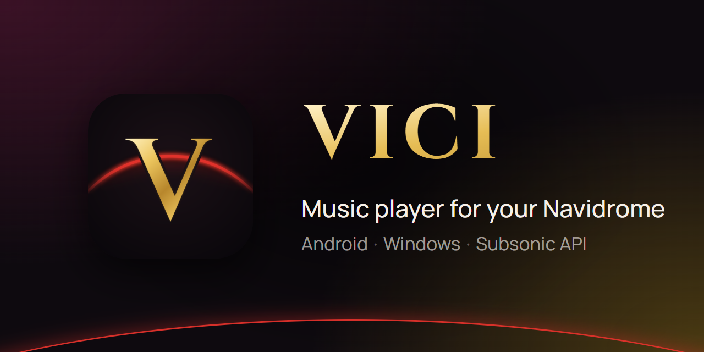
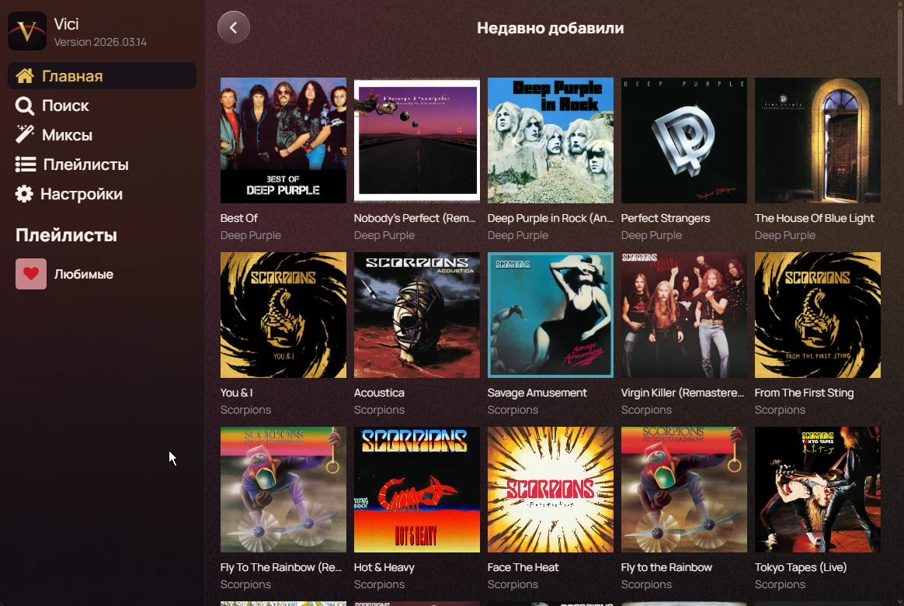
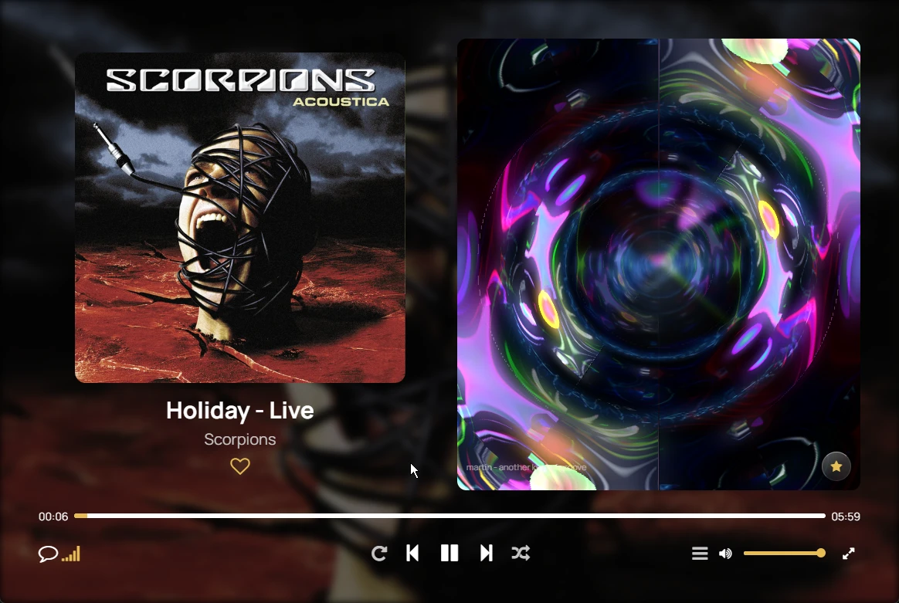
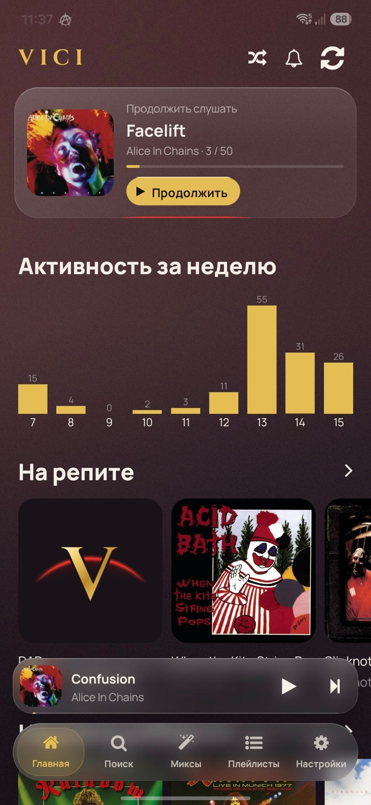
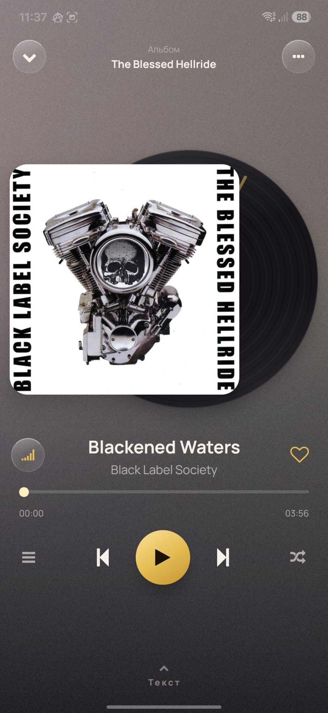

<p align="center">
  
</p>

<p align="center">
  <a href="https://github.com/Aut0iq/Vici/releases/latest"></a>
  <a href="https://github.com/Aut0iq/Vici/actions/workflows/android-release.yml"></a>
  <a href="LICENSE"></a>
  
  <a href="https://www.navidrome.org/apps/"></a>
</p>

<p align="center">
  <b>English</b> · <a href="#русский">Русский</a>
</p>

<table>
  <tr>
    <td width="50%"></td>
    <td width="50%"></td>
  </tr>
  <tr>
    <td align="center"><sub>Library: sidebar, now playing cover, queue<br>Фонотека: боковое меню, обложка играющего трека, очередь</sub></td>
    <td align="center"><sub>Full-screen player: cover on the left, visualizer on the right<br>Полноэкранный плеер: обложка слева, визуализатор справа</sub></td>
  </tr>
</table>

<table>
  <tr>
    <td width="50%"></td>
    <td width="50%"></td>
  </tr>
  <tr>
    <td align="center"><sub>Home: continue listening and library sections<br>Главная: продолжить слушать и разделы фонотеки</sub></td>
    <td align="center"><sub>Player with the cover and a spinning vinyl<br>Плеер с обложкой и вращающейся пластинкой</sub></td>
  </tr>
</table>

---

## English

**Vici** is a music player for your own [Navidrome] server and any other server with the Subsonic API. It runs on your phone and on your computer.

Vici is listed in the official [Navidrome client apps catalog](https://www.navidrome.org/apps/).

### Features

#### Look and feel

- **Cover-tinted background.** The interface takes on the colors of the playing track and changes with it.
- **Blur instead of solid fills.** The floating bottom bar, mini player and cards are translucent, with real blur and a light edge.
- **Full-screen player** with the cover and a spinning vinyl. Swipe left or right on the cover to change tracks, up to open the lyrics, down to close the player.
- **Visualizer.** Full-screen MilkDrop effects powered by [butterchurn]: 187 presets that react to the music.

#### Music

- **Lyrics** with line-by-line highlighting, taken from your server or from [LRCLIB]. The track length is checked so the lyrics always match the song.
- **Last.fm scrobbling** is sent straight from the device, nothing has to be set up on the server. It keeps an offline queue and counts sent scrobbles.
- **Endless random queue.** The random button starts a mix from your whole library and keeps loading new tracks as you listen, without repeats.
- **Mixes.** A separate tab for mood playlists whose names end with “mix”.
- **Continue listening.** A card on the home screen with your last queue.
- **Caching** of upcoming tracks for instant skipping and offline playback.
- Radio stations, favorites, playlists, search, casting and everything else Castafiore can do.

#### Phone

- **Customizable bottom bar.** Hide, restore or reorder any tab, and choose which tabs you can swipe between.
- **Swipe** left and right to switch tabs.
- **Autoplay on headphones.** Plug in your headset and the music keeps playing, even if the app was closed.
- **5×1 home screen widget** with the cover, title, controls and colors matched to the cover. Tap it to open the full-screen player.

#### Desktop

- **Sidebar** with your playlists and a large cover of what is playing now.
- **Play queue** in its own column on the right, so you can see what played and what comes next.
- **Full-screen mode** with the cover on one half of the screen and the visualizer on the other; lyrics are shown over the visualizer.
- **Media keys** on the keyboard and a track card in the system media controls.
- **Runs from the tray.** Closing the window hides it, the music keeps playing.
- **Remembers the volume** between launches.
- **Automatic updates.** The app offers to install a new version by itself.

### Installation

#### Android with Obtainium (automatic updates)

1. Install [Obtainium](https://github.com/ImranR98/Obtainium/releases).
2. **Add App** → paste `https://github.com/Aut0iq/Vici` → **Add**.
3. Install Vici from the list. Obtainium will tell you about new versions.

#### Android manually

Download `vici-*.apk` from the [latest release](https://github.com/Aut0iq/Vici/releases/latest) and open it on your phone.

#### Windows

Download `Vici-Setup-*.exe` from the [latest release](https://github.com/Aut0iq/Vici/releases/latest) and run it. The installer does not need administrator rights and installs the app for the current user only. After that, Vici updates itself.

#### Linux

Download a package from the [latest release](https://github.com/Aut0iq/Vici/releases/latest):

- `Vici-*.AppImage` runs on any distribution. Make it executable (`chmod +x Vici-*.AppImage`) and start it. The AppImage updates itself.
- `Vici-*.deb` is for Debian, Ubuntu and their derivatives: `sudo apt install ./Vici-*.deb`.

On first launch, enter your server address (for example, `https://music.example.com`), username and password.

### Building from source

You need Node.js 22, JDK 17 and the Android SDK.

```bash
npm ci

# Development build (installs next to the regular app and works with the dev server)
npx cross-env IS_DEV=true expo run:android

# Regular APK
npx expo prebuild --clean --platform android
cd android && ./gradlew assembleRelease -PreactNativeArchitectures=arm64-v8a
```

#### Desktop app

The desktop app is the Vici web build packaged with Electron. See [desktop/README.md](desktop/README.md) for details.

```bash
# Run in a window without building the installer
npm run desktop

# Build the installer into desktop/release
npm run export:desktop
```

### Credits

- [Castafiore](https://github.com/sawyerf/Castafiore) by **sawyerf**, the project Vici is based on.
- [Navidrome], the music server.
- [LRCLIB], an open database of synced lyrics.
- [butterchurn], a MilkDrop visualizer for the web.
- [Manrope](https://fonts.google.com/specimen/Manrope) and [Cinzel](https://fonts.google.com/specimen/Cinzel) fonts (SIL Open Font License).
- [React Native Track Player](https://github.com/doublesymmetry/react-native-track-player), [Expo](https://expo.dev/), [Electron](https://www.electronjs.org/), [react-native-android-widget](https://github.com/sAleksovski/react-native-android-widget).

### License

Vici is released under the [MIT](LICENSE) license © 2026 [Aut0iq](https://github.com/Aut0iq).

You are free to use, modify and distribute the code, including in your own projects, as long as the copyright notice and the license text are kept.

Vici is based on [Castafiore](https://github.com/sawyerf/Castafiore), whose source code is dedicated to the public domain ([Unlicense](https://unlicense.org/)).

---

## Русский

**Vici** — музыкальный плеер для вашего собственного сервера [Navidrome] и любого другого с Subsonic API. Для телефона и для компьютера.

Vici есть в официальном [каталоге клиентов Navidrome](https://www.navidrome.org/apps/).

### Возможности

#### Внешний вид

- **Фон из обложки.** Интерфейс мягко окрашивается в цвета играющего трека и меняется вместе с ним.
- **Размытие вместо заливки.** Парящее нижнее меню, мини-плеер и карточки сделаны полупрозрачными, с настоящим размытием и светлой кромкой.
- **Полноэкранный плеер** с обложкой и вращающейся пластинкой. Свайп влево и вправо по обложке переключает трек, вверх открывает текст песни, вниз сворачивает плеер.
- **Визуализатор.** Полноэкранные эффекты MilkDrop на движке [butterchurn] — 187 пресетов, реагирующих на звук.

#### Музыка

- **Тексты песен** с построчной подсветкой: берутся с вашего сервера или из [LRCLIB] с проверкой длительности трека, чтобы текст не перепутался.
- **Скробблинг Last.fm** отправляется прямо с устройства, серверу для этого ничего настраивать не нужно. Есть очередь для офлайна и счётчик отправленного.
- **Бесконечная случайная очередь.** Кнопка случайного воспроизведения собирает микс из всей фонотеки и по ходу прослушивания догружает новые треки без повторов.
- **Миксы.** Отдельная вкладка для плейлистов под настроение, чьё название заканчивается на «mix».
- **Продолжить слушать.** Карточка на главной с последней очередью.
- **Кэширование** соседних треков для мгновенного переключения и работы без сети.
- Радиостанции, избранное, плейлисты, поиск, трансляция по сети и всё остальное, что умеет Castafiore.

#### Телефон

- **Настройка нижнего меню.** Любую вкладку можно убрать из панели, вернуть обратно или переставить. Отдельно выбирается, участвует ли вкладка в переключении свайпом.
- **Переключение свайпом** влево и вправо между вкладками.
- **Автозапуск при подключении наушников.** Подключили гарнитуру — музыка продолжает играть, даже если приложение было закрыто.
- **Виджет 5×1** для рабочего стола: обложка, название, управление, цвет под обложку. Нажатие открывает плеер на весь экран.

#### Компьютер

- **Боковое меню** с плейлистами и крупной обложкой того, что играет сейчас.
- **Очередь воспроизведения** отдельной колонкой справа: видно, что было и что будет дальше.
- **Полноэкранный режим** с обложкой на одной половине экрана и визуализатором на другой; текст песни ложится поверх визуализатора.
- **Медиа-клавиши** на клавиатуре и карточка трека в системной панели управления звуком.
- **Работа из трея.** Крестик прячет окно, музыка продолжает играть.
- **Запоминает громкость** между запусками.
- **Автообновление** — приложение само предложит установить новую версию.

### Установка

#### Android через Obtainium (с автообновлениями)

1. Установите [Obtainium](https://github.com/ImranR98/Obtainium/releases).
2. **Add App** → вставьте `https://github.com/Aut0iq/Vici` → **Add**.
3. Установите Vici из списка. О новых версиях Obtainium сообщит сам.

#### Android вручную

Скачайте `vici-*.apk` со страницы [последнего релиза](https://github.com/Aut0iq/Vici/releases/latest) и откройте его на телефоне.

#### Windows

Скачайте `Vici-Setup-*.exe` со страницы [последнего релиза](https://github.com/Aut0iq/Vici/releases/latest) и запустите. Установщик не требует прав администратора и ставит приложение только для текущего пользователя. Дальше Vici обновляется сам.

#### Linux

Скачайте пакет со страницы [последнего релиза](https://github.com/Aut0iq/Vici/releases/latest):

- `Vici-*.AppImage` работает в любом дистрибутиве. Сделайте файл исполняемым (`chmod +x Vici-*.AppImage`) и запустите. AppImage обновляется сам.
- `Vici-*.deb` — для Debian, Ubuntu и производных: `sudo apt install ./Vici-*.deb`.

При первом запуске укажите адрес своего сервера (например, `https://music.example.com`), логин и пароль.

### Сборка из исходников

Нужны Node.js 22, JDK 17 и Android SDK.

```bash
npm ci

# Версия для разработки (ставится рядом с обычной, работает с сервером разработки)
npx cross-env IS_DEV=true expo run:android

# Обычная сборка APK
npx expo prebuild --clean --platform android
cd android && ./gradlew assembleRelease -PreactNativeArchitectures=arm64-v8a
```

#### Версия для компьютера

Настольное приложение — это веб-сборка Vici, упакованная в Electron. Подробности в [desktop/README.md](desktop/README.md).

```bash
# Запустить в окне, без сборки установщика
npm run desktop

# Собрать установщик в desktop/release
npm run export:desktop
```

### Благодарности

- [Castafiore](https://github.com/sawyerf/Castafiore) от **sawyerf** — проект, на основе которого создан Vici.
- [Navidrome] — музыкальный сервер.
- [LRCLIB] — открытая база синхронизированных текстов песен.
- [butterchurn] — реализация визуализатора MilkDrop для веба.
- Шрифты [Manrope](https://fonts.google.com/specimen/Manrope) и [Cinzel](https://fonts.google.com/specimen/Cinzel) (SIL Open Font License).
- [React Native Track Player](https://github.com/doublesymmetry/react-native-track-player), [Expo](https://expo.dev/), [Electron](https://www.electronjs.org/), [react-native-android-widget](https://github.com/sAleksovski/react-native-android-widget).

### Лицензия

Vici распространяется под лицензией [MIT](LICENSE) © 2026 [Aut0iq](https://github.com/Aut0iq).

Код можно свободно использовать, изменять и распространять, в том числе в своих проектах, при условии сохранения уведомления об авторских правах и текста лицензии.

Vici основан на [Castafiore](https://github.com/sawyerf/Castafiore), исходный код которого передан в общественное достояние ([Unlicense](https://unlicense.org/)).

[Navidrome]: https://www.navidrome.org/
[LRCLIB]: https://lrclib.net/
[butterchurn]: https://github.com/jberg/butterchurn
